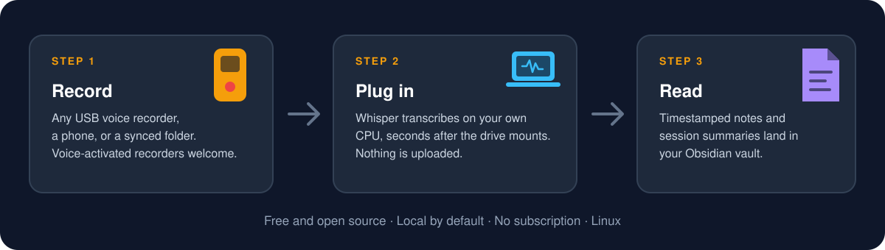

# USB Audio Transcriber

[](https://github.com/aaacharlie/usb-audio-transcriber/actions/workflows/ci.yml)
[](LICENSE)
[](#requirements)

**Plug in a voice recorder. Walk away. Come back to timestamped, searchable notes and a summary of the whole session.**

<p align="center">
  
</p>

USB Audio Transcriber is a free, open-source Linux utility that turns a cheap voice recorder into a hands-off note-taking system. Plug the recorder in and, within seconds, it finds the new recordings, copies them to a checksum-verified archive, transcribes them locally with faster-whisper, and writes timestamped Markdown notes straight into your Obsidian vault or any notes folder. When a voice-activated recorder has split a meeting or a class into a dozen files, it stitches them back into one session note in the right order and, if you want, has an AI write the executive summary.

There is no subscription, no per-minute pricing, and no uploading of your audio. Transcription runs on your own CPU with no GPU required, the source recordings stay on the device, and nothing leaves your machine unless you explicitly turn on the optional cloud summary.

## Quick start

On Debian or Ubuntu (other distributions: the same packages under their own names):

```bash
sudo apt install python3-venv ffmpeg zenity libnotify-bin git
curl -fsSL https://raw.githubusercontent.com/aaacharlie/usb-audio-transcriber/main/bootstrap.sh | bash
```

The installer creates a private virtual environment, asks where your notes should go (it finds your Obsidian vaults for you), and enables the background service. Then plug in the recorder. Run the same line again later to update.

Prefer to read the code first? Clone the repository and run `./install.sh`; see [Install](#install).

## What you get

- **Zero-touch workflow.** A systemd user service watches for the recorder. A cycle starts the moment the drive mounts, with a one-minute timer as the safety net. You never run a command after setup.
- **Session notes with an executive summary.** Recordings less than 20 minutes apart become one session note: links to every transcript, one combined transcript in order, and, with an OpenRouter key, an AI summary written from a prompt you can edit. The stitching works offline; only the summary needs a key.
- **Any folder, not only USB.** Point `WATCH_DIRS` at a Syncthing, Nextcloud, or Dropbox folder and phone voice memos are transcribed too. Files there are never deleted.
- **Built for Obsidian.** The setup wizard finds your vault. Notes carry YAML front matter and tags, session notes use `[[wikilinks]]`, so backlinks and the graph view just work, and Obsidian Sync or Syncthing carry everything to your phone.
- **Private by default.** Audio never leaves your computer. Optional summaries send transcript text only, and only when you set a key.
- **Never loses a recording.** Every copy is SHA-256 verified before it enters the queue, duplicates are detected by content rather than filename, and the USB source is never deleted unless you opt in.
- **Speaker labels, optionally.** Turn on pyannote diarization for `Speaker 1` / `Speaker 2` labels, computed locally.
- **Desktop-friendly.** A progress window with a time estimate, and a notification you can click to open the finished note.
- **Runs headless.** No desktop? Put it on a Raspberry Pi or a home server and let the notes land in a synced folder.
- **Pick your speed.** `fast` transcribed a 58-minute recording in about 17 minutes on a plain CPU. `accurate` is there for hard audio, and `both` gives you an A/B comparison from the same file.

Good fits: lectures and classes, meetings and site visits, interviews, long phone calls on speaker, and voice memos you would otherwise never listen to again.

## Real-world test: a $50 recorder from Amazon

This project was built around, and tested with, an inexpensive magnetic voice-activated recorder that sells on Amazon for about $50. The listing is titled "136GB(9800H) Magnetic Voice Recorder - Zutiifeu Voice Activated Recorder with DSP5.0 Noise Cancellation HD Recording Device for Classe/Meeting/Lecture". It has been used with this pipeline with lots of success, and the combination is the whole point of the project: a budget recorder plus a Linux box you already own gives you a complete recording-to-notes system.

What it looks like in practice:

1. Record with the device. Voice activation means it can sit for hours and only capture the parts where someone is talking.
2. Plug it into your Linux machine's USB port. The recorder mounts like an ordinary flash drive and a cycle starts within seconds.
3. The progress window shows what was found and how long it expects to take. When it is done, a notification appears; click it to open the notes.
4. Open your vault. Every recording has a dated, timestamped transcript note, and the whole sitting has a session note that ties them together.

Any recorder, phone, or SD card that mounts as a drive and saves into a folder should work the same way. Point `RECORDER_DIR` at the folder your device saves into (the default is `RECORD`) and add your device's file extension to `AUDIO_EXTS` if it is not `mp3`, `wav`, or `m4a`. Recorders other people have tried are collected in the repository's Discussions; please add yours.

This project has no affiliation with the recorder's manufacturer or with Amazon. It is simply the hardware the pipeline was tested on.

## The transcript looks rough? Don't be discouraged

Raw Whisper output from a pocket recorder can look underwhelming at first glance: no paragraphs, misheard names, a sentence that trails off where the voice activation paused, and long sessions split across several files. That is normal, and it is not the finished product.

The raw transcript is the input to the last step. Give the transcripts of a session to a current frontier model (tested with GPT 5.6 Sol) and ask it to put them in order and summarize them. The model reads straight through the transcription noise, reconstructs the flow of the conversation, and returns a very high quality executive summary of the whole session.

The pipeline can do this for you. Set `OPENROUTER_API_KEY` in `config.env`, name a strong model in `SESSION_SUMMARY_MODEL`, and tell it what your recordings are about in `SESSION_SUBJECT`. Every session note then opens with the summary, generated from [`prompts/session-summary.md`](prompts/session-summary.md), which you can edit.

To do it by hand instead, or with a model of your own choosing:

1. Open the session note in your vault. Its `## Combined transcript` section already has every recording in order. (Without session notes, collect the transcript notes for the sitting; their filenames start with the recording's date and time, so the order is in the names.)
2. Paste it into one chat with the model.
3. Use a prompt like this one, replacing the bracketed part with the topic of the recording:

```text
You are the world's best transcript reader and interpreter, and you are very
knowledgeable in [insert subject matter]. Can you take all of these audio
transcript files and put them in the correct order and summarize it completely?
Make it an amazing, coherent transcript summary in the proper order. Make it
something better than other AI services like Otter.
```

Tips that make the summary better:

- Name the subject matter precisely ("commercial real estate financing", "organic chemistry lecture", "quarterly planning meeting"). It helps the model fix misheard jargon and names.
- Turn on speaker labels, or tell the model who was in the room, so it can attribute what was said.
- Ask for decisions, action items, and open questions as separate sections if you want a meeting-style report. The bundled prompt already does.
- Use a model with a large context window so a whole day's notes fit in one request.

Either way, remember that pasting a transcript into a cloud AI sends its text to that provider. Keep sensitive recordings local.

## Documentation

- [Documentation wiki](docs/README.md)
- [Usage guide](docs/usage.md): workflow, outputs, folder watching, session notes, speaker labels, headless machines
- [Obsidian](docs/obsidian.md): the setup wizard, what lands in the vault, sync
- [Configuration reference](docs/configuration.md)
- [Whisper model profiles and measured trade-offs](docs/model-profiles.md)
- [Architecture and data lifecycle](docs/architecture.md)
- [Troubleshooting](docs/troubleshooting.md)
- [Privacy and security](docs/privacy-and-security.md)
- [Development guide](docs/development.md) and [changelog](CHANGELOG.md)

## What it does

1. A user-level systemd path unit starts a cycle when a drive mounts under `/media/$USER`, `/run/media/$USER`, or `/mnt`; a timer also runs a cycle about once per minute.
2. The cycle finds supported audio files inside the recorder directory (default `RECORD`) on mounted media, plus anything in `WATCH_DIRS`.
3. It copies new recordings to a local archive and verifies the copy with SHA-256.
4. It deduplicates future scans using SQLite, then transcribes queued recordings locally with faster-whisper, optionally labelling speakers.
5. It writes `.json` segments, `.txt` text, a Markdown transcript note, and a `.complete.json` marker that confirms all outputs finished.
6. It groups the finished recordings into sessions and writes one session note per sitting, with an AI summary when a key is configured.
7. During transcription a desktop progress dialog shows the active file, number of files, percentage, and ETA; a notification announces the finished notes.

## Privacy and safety

- Transcription and speaker labelling are local. Audio is not uploaded by this project.
- Optional OpenRouter summarization is disabled by default. If you set `OPENROUTER_API_KEY`, transcript text, never audio, is sent to OpenRouter for the per-recording and session summaries.
- Source audio on the USB drive is never deleted by default (`PURGE_DEVICE=0`), and files in `WATCH_DIRS` are never deleted at all.
- Do not commit `config.env`: it can contain API keys. The included `.gitignore` excludes it and all runtime data.

## Requirements

- Linux with a user systemd session (desktop or headless)
- Python 3.10+
- `ffmpeg` for audio decoding
- `git` for the one-line installer
- Optional: `zenity` for the progress window, `libnotify-bin` for notifications
- Internet access the first time faster-whisper downloads the configured model

On Ubuntu/Debian:

```bash
sudo apt install python3-venv ffmpeg zenity libnotify-bin git
```

## Install

Either the one-line installer from [Quick start](#quick-start), or from a clone:

```bash
git clone https://github.com/aaacharlie/usb-audio-transcriber.git
cd usb-audio-transcriber
./install.sh                      # add --with-diarization for speaker labels
```

The installer deploys to `~/.local/share/usb-audio-transcriber`, creates a virtual environment, runs the setup wizard on a fresh configuration, and enables the timer and the plug-in trigger. Settings live in `~/.local/share/usb-audio-transcriber/config.env`; `config.example.env` documents every option, and `bin/setup.py` changes the essentials without editing.

### Update an existing installation

```bash
cd usb-audio-transcriber
git pull --ff-only
./install.sh
```

or run the one-line installer again. Either way the installed `config.env` is preserved.

### Uninstall

```bash
./uninstall.sh
```

This removes deployed code, the virtual environment, and the user systemd units. It deliberately preserves `config.env`, runtime state, archives, transcripts, and model caches so uninstalling cannot silently erase user data.

## Status and logs

```bash
systemctl --user status usb-audio-transcriber.timer
systemctl --user status usb-audio-transcriber-plug.path
systemctl --user status usb-audio-transcriber.service
journalctl --user-unit=usb-audio-transcriber.service -f
```

The pipeline also logs to `~/.local/share/usb-audio-transcriber/var/logs/pipeline.log`.

Run the built-in diagnostic after installation or whenever setup fails:

```bash
~/.local/share/usb-audio-transcriber/venv/bin/python \
  ~/.local/share/usb-audio-transcriber/bin/doctor.py
```

It checks configuration, required commands and Python packages, writable output locations, the timer, and the plug-in trigger without creating recordings or transcript data.

## Configuration

`config.example.env` documents all options. The ones people change:

- `VAULT_DIR`: where Markdown notes go; the wizard points it at a folder inside your Obsidian vault.
- `WATCH_DIRS`: extra folders to scan, colon-separated, for synced phone memos or shares.
- `RECORDER_DIR` and `AUDIO_EXTS`: the folder name and file types your recorder uses.
- `WHISPER_MODEL_PROFILE`: `fast`, `accurate`, or `both`.
- `OPENROUTER_API_KEY`, `SESSION_SUMMARY_MODEL`, `SESSION_SUBJECT`: optional AI summaries and the model and topic used for them.
- `SESSION_GAP_MIN`: how long a silence has to be before a new session starts (20 minutes).
- `DIARIZATION` and `HF_TOKEN`: optional speaker labels.
- `HEADLESS` and `NOTIFY`: desktop window and notifications, `auto` by default.
- `PURGE_DEVICE`: leave at `0` unless you explicitly want copied recordings removed from the USB device.

### Whisper model choices

| Profile | Model | Pros | Cons |
| --- | --- | --- | --- |
| `fast` | `distil-large-v3` | Fastest supported option; lower disk, RAM, and CPU cost | Can be less reliable on distant, overlapping, or otherwise difficult speech |
| `accurate` | `large-v3` | Best accuracy-oriented option; more robust on difficult audio | Substantially slower on CPU; about 2.9 GiB of disk cache |
| `both` | both models | Produces a direct A/B comparison from the same recording | Takes the combined runtime and disk space of both models |

In one real CPU benchmark of a 57m 45s recording, `distil-large-v3` finished in 16m 56s while `large-v3` took 89m 57s: 5.31 times longer. That run was CPU-only on a GEEKOM X16 laptop (NX16AM): an Intel Core Ultra 9 185H (16 cores / 22 threads), 32 GB RAM, integrated graphics, running Ubuntu 26.04 LTS with GNOME — a consumer laptop, not a GPU workstation. Treat it as one hardware/audio data point, not a universal benchmark. See [Whisper model profiles](docs/model-profiles.md) for the complete result and interpretation.

Models are loaded into RAM only while they are being used, and downloaded weights stay in the Hugging Face disk cache. Manage them with `bin/model-cache.py status|download|remove`, and compare models on one file without touching the live queue with `bin/benchmark-models.py`; both are described in the [usage guide](docs/usage.md).

## Development checks

```bash
python3 -m py_compile bin/*.py
bash -n install.sh uninstall.sh bootstrap.sh bin/run-cycle.sh
python3 -m unittest discover -s tests -v
```

See [CONTRIBUTING.md](CONTRIBUTING.md) before submitting a change. Report security issues privately according to [SECURITY.md](SECURITY.md).

## License

MIT. See [LICENSE](LICENSE).
